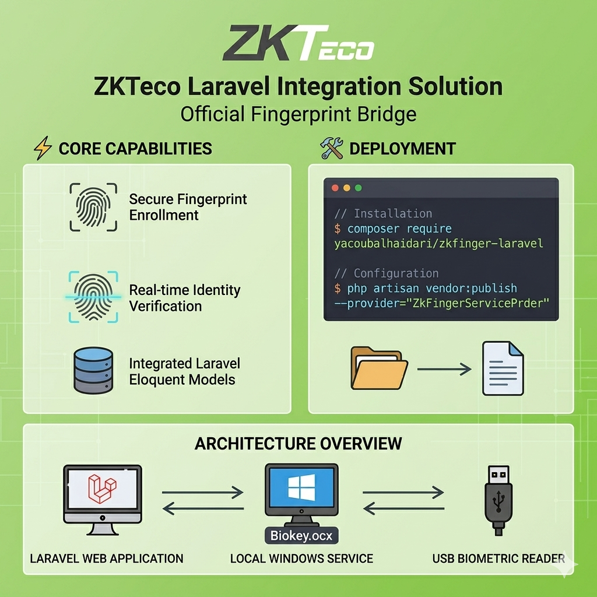

# ZK Fingerprint Reader Laravel Bridge

A Laravel package to integrate ZKTeco ZKFinger SDK (Biokey.ocx) via a local Windows agent bridge.

## ⚡ Features

- Enroll, capture, verify, and identify fingerprints using ZKTeco SDK
- Communicates with a local Windows agent (wraps Biokey.ocx)
- Eloquent model for fingerprint templates
- Migration and config publishing

## 🛠️ Installation

1. **Require the package** (if published to Packagist):
    ```bash
    composer require yacoubalhaidari/zkfinger-laravel
    ```
    Or add as a local package in `composer.json`:
    ```json
    "repositories": [
      { "type": "path", "url": "packages/zk-fingerprint-reader" }
    ]
    ```
    Then run:
    ```bash
    composer require yacoubalhaidari/zkfinger-laravel
    ```
2. **Publish config:**
    ```bash
    php artisan vendor:publish --tag=zkfinger-config
    ```
3. **Run migration:**
    ```bash
    php artisan migrate
    ```
4. **Deploy the local Windows agent** (see below).

## ⚙️ Configuration

Edit `config/zkfinger.php` as needed. Set the agent URL in your `.env`:

```
ZKFINGER_AGENT_URL=http://127.0.0.1:8080
```

## 🖥️ Local Windows Agent

You must run a local service on each client machine that wraps the ZKTeco Biokey.ocx ActiveX control and exposes an HTTP API. Example endpoints:

- `/enroll` (POST)
- `/capture` (POST)
- `/verify/1:1` (POST)
- `/identify/1:N` (POST)
- `/cache/create` (POST)
- `/cache/add` (POST)

See the package documentation or ask for a sample Node.js, Python, or C# agent.

## 📖 Usage Example

Example controller usage:

```php
use Yacoubalhaidari\ZKFinger\Services\ZKFingerAgentClient;
use Yacoubalhaidari\ZKFinger\Models\FingerprintTemplate;

public function enroll(Request $request, ZKFingerAgentClient $zk) {
    $userId = $request->input('user_id');
    $result = $zk->enroll($userId);
    FingerprintTemplate::create([
        'user_id' => $userId,
        'template_b64' => $result['template_b64'],
        'template_type' => config('zkfinger.template_type'),
        'engine_version' => config('zkfinger.engine_version'),
    ]);
    return response()->json(['status' => 'enrolled']);
}
```

## 📝 License

MIT
